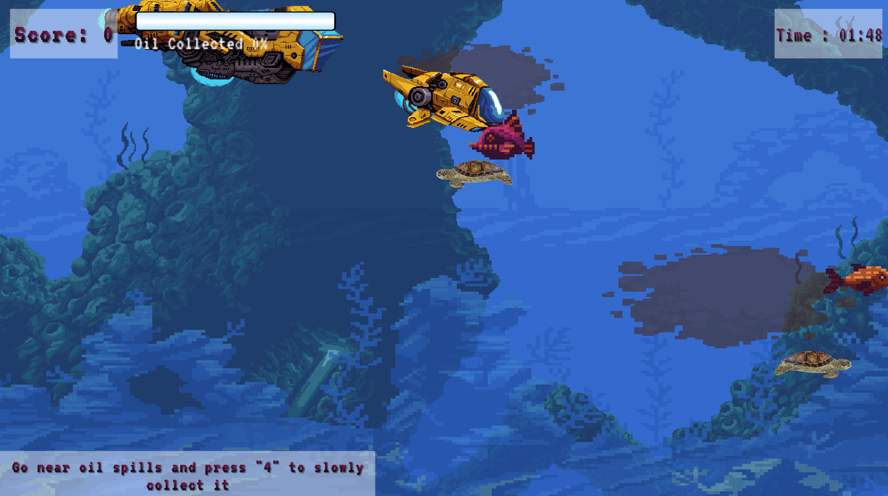

# Helping Nemo (“Be a Rambo, to our Nemo”)

Description of your game, the frameworks/technologies used for its development, the platforms supported by your game and the contribution of each of the teammates towards game development.

---
## **Description**

Helping Nemo is a game designed to help save water resources from getting polluted. We tried to capture types of pollution possible underwater and tried to spread awareness to the users about it. The significant problems we focus on are garbage thrown in the water, oil spills that happen due to the factories, and the underwater animals that get stuck in the nets and plastics.
Nemo, the chitti robot, tries to clean the water resources with the help of the user. The ship releases the Nemo into the water, and the ship also stores the garbage collected inside it.

Another thing to note is that we made all game assets pixelated, but the garbage and nets are not pixelated, which makes them look like they don't belong there in that scene, which is a subtle metaphor.

---
## **Frameworks/Technologies**

For the development of this game, the Unity Framework was used. To program the scripts and control the logic of the programs, C# was used as it is compatible with Unity and follows OOPS concepts. For deployment, we used WebGl format to be deployed and played on websites. For hosting, simmer.io was used for its easy and on the go deployment features. Since the game is WebGL format, it can be played in any modern browser and is supported by all platforms.

---
## **System Requirements**
The minimum required ram is 4 GB. Recent CPU and Video card with updated drivers. latest version for any of the following websites:-

- Chrome
- Firefox
- Safari
- Edge

---
## **Online Hosted**  
(Link)[https://simmer.io/@AMITKESARI2000/helpingnemo]

---
## **Characters**
- Nemo
  - Main Character
  - Fish friendly
  - Can collect garbages from the ocean.
  - Can rescue turtles by cutting nets.
  - Can suck oil spilled in the ocean.
  - Ship
  - Spawns Nemo and drops it
  - Store garbages and oil collected by Nemo.

---
## CONTROLS
  - Movement: WASD / Arrow keys
  - Pulse: Space
  - Collect Garbage: 2
  - Net Cutter: 3
  - Oil Collector: 4
  - Dumping into mothership: 9
  - Toggle Help: h
  - Restart Game: 1
  - Go to next level: 0

---

## **Levels**
### Intro:
> Menu and Story

### 1st level: Garbage Collection (Collector Nemo)
>Nemo has to collect garbages thrown by people into the ocean.
After collecting a certain amount of garbage, it has to dump it into the carrier ship.
For completing this level, Nemo has to cross a threshold score in the given time.

### 2nd level: Rescue The Turtle (Cutter Nemo)
> Nemo will get a net cutter.
With great power comes a great responsibility.
Now, Nemo has to rescue the turtles by cutting the net, in which it is stuck.
To complete this level, Nemo has to rescue a certain number of turtles in the given time.

### 3rd level: Suck Spilled Oil (Sucker Nemo)
> Unfortunately, Oil is spilled in the ocean. It can be natural or by mistake of humans
Now, Nemo has to suck them and store them in the carrier ship.
To pass this level, Nemo has to cross the threshold score of oil collection in the given time.

### 4th level: Main Game (Nemo Nemo)
> Now, Nemo is prepared to tackle all at once.
In this level, Nemo has to collect garbage, rescue turtles and suck spilled oil.
To pass this level, Nemo has to cross a threshold score.

### 5th level: Pro Mode (Pro Nemo)
> Nemo has tackled all odds thrown at him (and the ocean)
In this level, Nemo has to collect garbage, rescue turtles and suck spilled oil with increased difficulty.
To pass this level, Nemo has to cross a threshold score with a more strict time limit.

### Survival Mode:
> Similar to Level 4 and 5.
Once you finish a fixed set of materials your time limit will be increased by 30 sec
It will go on till time remaining is 0.

---

## The Code Language
- C#

## Required Software for development
- unity engine with WebGl module
- github(like github desktop)

## Developers

- Aditya Sharma
- Amit Kesari
- Anu Anand Annu
- Emani Sowmya
- Varun

